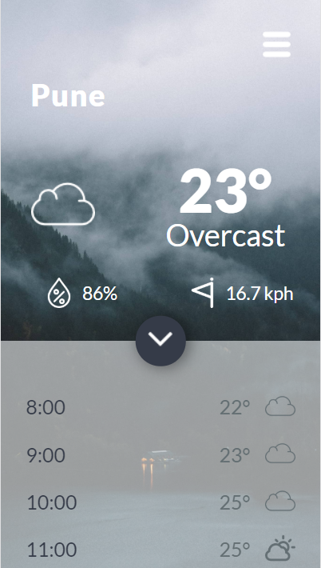
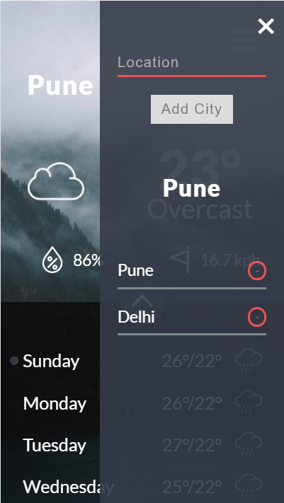

# weather-app
Weather App from scratch with HTML, CSS and JavaScript.

###### WHAT IS THIS PROJECT ABOUT?

- Connect HTML, CSS and JavaScript in a complex application.

- Add Google Fonts, a Theme Color for mobile phone and a Loading Screen.

- Build complexe user interface with Flexbox.

- Use an API (for this we will use two different API's in order to get the weather data for our web app: Dark Sky & Open Cage Data).

- Write modular JavaScript (here we will use the module pattern while we will write the code for our weather app).

- Use and store data in Local Storage in order to save the user preferinces.

- Build front-end application from ground up with no framework.

## Screenshots

## Status
Project is: _in progress_

## Contact
Created by [@AmitHebbi](https://github.com/AmitHebbi) - feel free to contact me!
